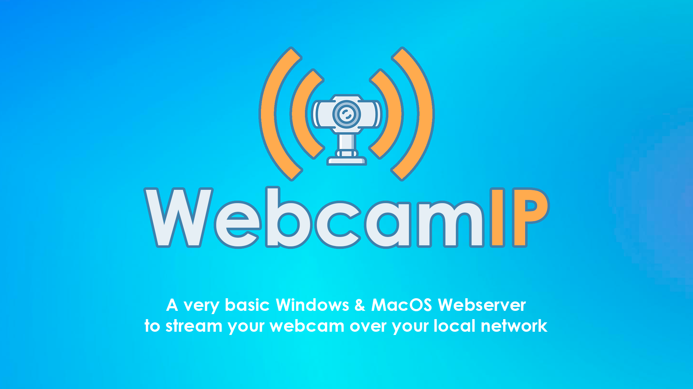

# Webcam IP



A simple server application for Streaming Webcam Image via WebSocket.

## Motivation

As WSL2 still doesn't have simplified native support for using a Webcam, I decided to create this very basic C++ application for Windows and capture the Webcam signal via WebSocket in my OpenCV applications running on WSL2.

Now Mac (Apple Silicon) is also supported.

# Windows

## Pre-Requisites

- Windows 7 or newer
- Git
- Visual Studio 2015 Update 3 or newer

## Build

The easiest way to build C and C++ applications on Windows is by using Visual Studio Community and VcPkg to manage the extensions.

- Install [Visual Studio Community](https://visualstudio.microsoft.com/vs/features/cplusplus/) with C++ features.
- Clone [VcPkg GitHub repository](https://github.com/Microsoft/vcpkg) in a short path directory like **'C:\tools\vcpkg'**:
  ```cmd
  git clone https://github.com/microsoft/vcpkg.git C:\tools\vcpkg
  ```
- Run the VcPkg bootstrapping process:
  ```cmd
  cd C:\tools\vcpkg
  .\bootstrap-vcpkg.bat
  ```
- Make all installed packages available to all VS projects:
  ```cmd
  vcpkg integrate install
  ```

## Project Requirements

```cmd
vcpkg install opencv crow boost-program-options
```

There is no need for any additional configuration. Just build the application.

## Run Server

Go to the built application folder using the terminal then run the camera server:

```cmd
.\webcam-ip.exe
```

> It will use the default options.

Options:  
 --help: Show help  
 --port **arg**: Server port [default: 8080]  
 --camera **arg**: Windows Camera Index [default: 0]

Example:

```cmd
.\webcam-ip.exe --port 8081 --camera 1
```

## Accessing Windows Networking Apps from Linux WSL2 (SERVER IP)

Obtain the IP address of your host machine by running this command from your Linux distribution:

```bash
cat /etc/resolv.conf
```

Copy the IP address following the term: nameserver.  
Connect to any Windows server using the copied IP address.  
The picture below shows an example of this by connecting to a Node.js server running in Windows via curl.  


# Mac (Apple Silicon)

## Pre-Requisites

- macOS (Apple Silicon) - Tested with Sonoma and M1 Pro Chip
- Git
- [Homebrew](https://brew.sh/)

## Project Requirements

```bash
brew install cmake opencv boost
```

## Build

From this project's root path:

```bash
mkdir build
cd build
cmake ..
make
```

## Run Server

Go to the built application folder using the terminal then run the camera server:

```bash
./webcam-ip
```

> It will use the default options.

Options:  
 --help: Show help  
 --port **arg**: Server port [default: 8080]  
 --camera **arg**: Camera Index [default: 0]

Example:

```bash
./webcam-ip --port 8081 --camera 1
```

# Client Example

With the server running, you can use the test clients to preview. In the folder _examples_ there are application examples for the client in:

- HTML/JavaScript for an easy test (just open index.html)
- Python to run inside WSL2/Docker/another Linux machine in the same network.

> The Python example applies a Grayscale filter to the received image from the server.  
> Change the **SERVER_IP** value in **get_camera_streaming.py** before running.  
> Change the port in the client if you change the default when running the server.  
> You will need the server running to test the client.
